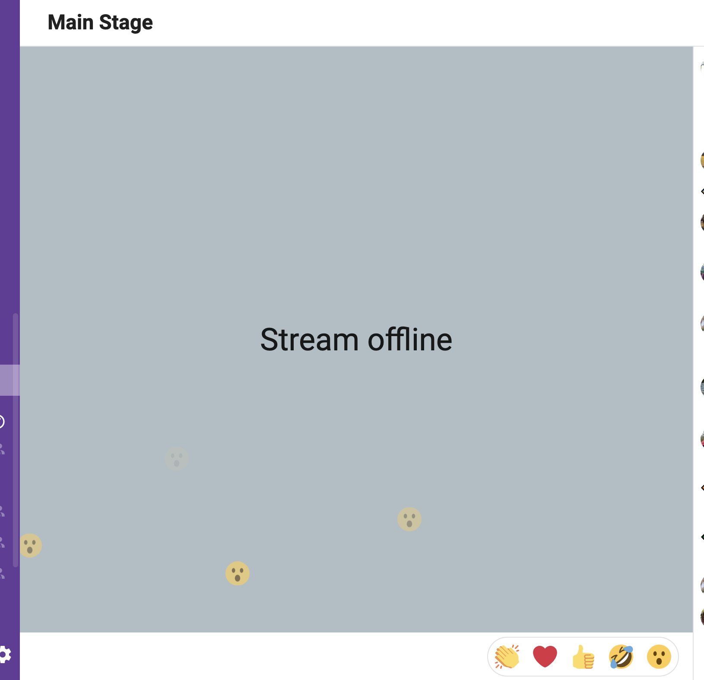
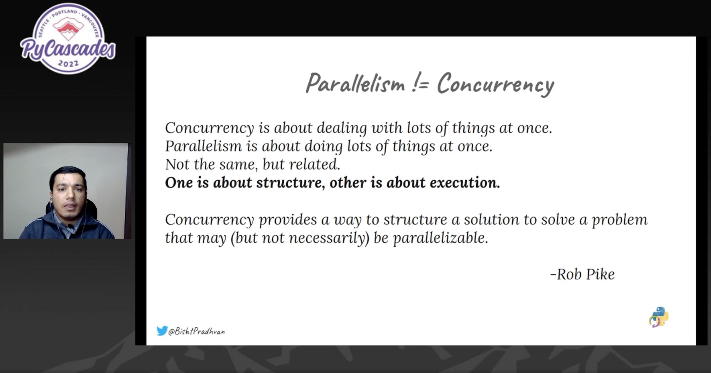
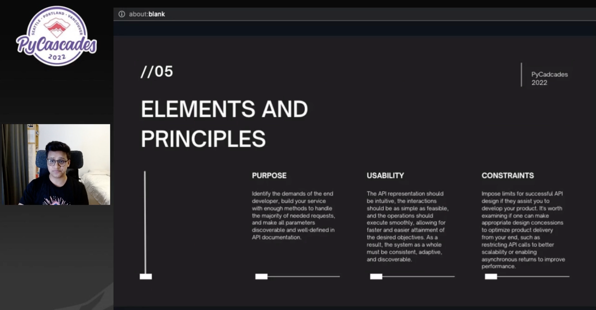
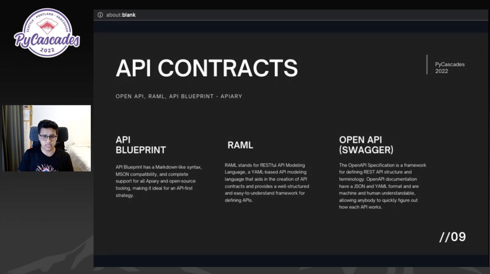

# Pycascades 2022

Notes from the virtual conference

Schedule: <https://2022.pycascades.com/program/schedule/>

## Welcome to Pycascades 2022

<https://pretalx.com/pycascades-2022/talk/MVLLML/>

> A huge welcome to everyone leading into our morning talks.

<https://photobooth.pycascades.com/>

---

## Meet & Greet with PSF D&I workgroup

<https://pretalx.com/pycascades-2022/talk/3HKZTJ/>

> Python has become one of the most popular programming languages in the world,
> meaning that along with this growth the Python community has continued to
> expand, in every continent around the globe. While this growth has been
> exciting, it has also brought new challenges and opportunities to improve our
> global community. Through this panel, we would like to address those
> challenges and understand our community better.



---

## Supporting the George Floyd Protests in Portland: Demonstrations, Legal Support, and Django Apps

<https://pretalx.com/pycascades-2022/talk/CZRPCJ/>

> Portland’s protests following the murder of George Floyd involved thousands of
> people. Providing bail and legal support to those arrested at the protests
> required a massive amount of volunteers, resources, and an incredibly
> hard-working Django app.

Link to blog post about talk, slides, etc:
<https://www.thursdaybram.com/talk-supporting-the-george-floyd-protests-in-portland-demonstrations-legal-support-and-django-apps>

Challenges of supporting legal funding for protestors.

Scraping data from public judicial systems.

Misreporting of race on arrest reports by Police.

Use of Django to build app to manage this data & how successful it was.

---

## Python’s tale of concurrency

<https://pretalx.com/pycascades-2022/talk/WEYYJG/>

> Python is underrated when it comes to concurrency. The main aim of the talk
> would focus on exploring the general concept of concurrency and how we can
> utilise those concepts to write Python programs that are more scalable and
> more efficient in terms of I/0 bound operations. From the threading module and
> its limitations, to the asyncio module with its async and await keywords. We
> will look into different types of concurrent programming techniques available
> in Python though the major focus would be on the asyncio module, exploring
> best practises and common pitfalls while using asyncio.



---

## AMA with Brett Cannon

In the MS booth, overlapped with the concurrency talk so bounced between the two.

<https://repl.ethanhs.me/> - Python 3.11alpha running via WASM in a browser.

---

## Intellicode Demo

Extension: Visual Studio code intellicode API examples

---

## Building Elegant API Contracts: From Zero to Hero

<https://pretalx.com/pycascades-2022/talk/ESCJLQ/>

>Learn how one can write efficient APIs with high-quality API specifications
>using Open API and RAML specs to create API contracts and achieve a better
>experience using the API with more reliable unit tests and increased response
>consistency.

Presenter's Twitter: <https://twitter.com/BishtPradhvan>

Slides <http://bit.ly/3rtM5Gt>

API Contracts:

* <https://apiblueprint.org/>
* <https://raml.org/>
* <https://swagger.io/specification/>





---

## Cyber Security Investigations with Jupyter Notebooks

<https://pretalx.com/pycascades-2022/talk/RF3L8D/>

> upyter notebooks are growing in popularity among CyberSec analysts. For threat
> hunting and incident investigations, notebooks give you flexibility not found
> in most Security Operations Center (SOC) toolsets.
>
> However, threat hunting requires specialized tools, analytics and
> visualizations that aren't part of the typical data science libraries. We'll
> show some of the features of the MSTICPy CyberTools library that we built to
> address these gaps.

<https://github.com/microsoft/msticpy>

---

## How (Not) to Start a Python User Group

<https://pretalx.com/pycascades-2022/talk/9KJWWL/>

> Starting a local Python User Group is hard. Keeping it running month after
> month is even harder. As a Python User Group organizer, I've had my fair share
> of mess ups.
>
> In this talk, we'll examine some ways not to run your own Python User Group
> based on my own experiences as an organizer. By looking back at my own
> missteps, we'll determine some best practices for getting your own User Group
> off the ground. By the end of the talk, you'll be well equipped to run your
> User Group long-term. Come laugh and learn as we journey through my meetup
> misadventures and prepare you for your own.

Fun presentation, lots of good advice around organizing a UG.

* check for existing group, see if you can join
* throw your UG on a wiki, if your group ends, remove from wiki
* keep your website in sync (don't let cert/domains expire, etc)
* reach out to local businesses about hosting meetups
* for other organizer, find someone reliable, etc, be kind when asking
* getting people to come: reach out to friends/colleagues, but not spammy
* check local universities for mailing lists, etc
* use social media (low cost ad campaigns?)
* create eye-catching graphics
* there is an official Python channels of communication (wiki, email lists)
* get feedback from meeting members & take it seriously
* inform attendees about meeting structure beforehand (should they bring a
  computer? is there food? what are they in for?)
* if presenting, prepare!
* get the community involved, find others who might be willing to present or do
  lightning talks

Spokane Python User Group <https://spokanepython.com/>

---

## Invisible Walls: Isolating Your Python

<https://pretalx.com/pycascades-2022/talk/YLBZLQ/>

> Stop building projects that only "work on my machine", Learn how to isolate
> your python application by executing in an isolated, reproducible environment
> that extends beyond the code you write.

Speaker's twitter: <https://twitter.com/ucodery>

---

## Literature Text Translation and Audio Synthesis using AI Services

<https://pretalx.com/pycascades-2022/talk/FP87MV/>

> Ever wanted to read your favourite literature book or poetry but language is a
> barrier? Worry not! Enjoy the world literature in your preferred language
> along with audio book with just a click of a button. "Literature Love" uses AI
> services to translate and generate audio format for literature texts

Did not attend, as wasn't interested in the topic.

---

## MS Booth: What's New in VS Code Python?

Luciana Abud demoing some of the new features of Python in VS Code.

Change to how the Python interpreter is selected, no longer is the
`config:python.pythonPath` setting in settings.json, now is stored in config.
To reference this in a tasks.json file, use "command:python.interpreterPath".

In settings.json can specify a default interpreter to show in the select
interpreter list: python.defaultInterpreterPath

Python Environment Manager extension:
<https://marketplace.visualstudio.com/items?itemName=donjayamanne.python-environment-manager>

New rename file assistance, on renaming a module gives a refactoring preview of
propagating that change to other files.

New selection keyboard shortcuts (expanding selections)

Visual Studio Intellicode, integrated into hover tips

Demoing the debugger, remembers last-used config for workspace

Showing integrated test explorer

Python: Report Issue item in the command pallette for filing bugs on the Python
Extension.

---

## Tests as Classifiers

<https://pretalx.com/pycascades-2022/talk/UVFAMG/>

> The reason to write, and run, tests on the code is to detect bugs before the
> code is being used by the customer. Too often, this purpose is forgotten when
> deciding how, and what, to test. What makes a good test? What makes a good
> test-suite? How can you measure it?
>
> By modeling tests as a "classifier", where the label is "buggy" or "not
> buggy", the general theory of classification can be applied. The basics of the
> theory, such as precision, recall, and F-score, will be explored, as well as
> how it applies to test suites. Specific techniques for measuring test quality,
> using tools such as mutation testing, tracing, and CI systems, will be
> presented.

Think of test (suites) as classifiers

Input: Code change
Output: Is the code buggy?

Possible way to show value of test suite

```code
# rewards not-alarming
precision = (
    true_alarms /
    (true_alarms + false_alarms)
)

# rewards alarming:
recall = (
    true_alarms /
    (true_alarms + missing_alarms)
)
```

Need to balance precision & recall -- F score (harmonic mean).

What if precision & recall shouldn't be evenly weighted -- F beta score.  Beta
param encodes utility what error hurts harder. Beta 2 == very sensitive to bugs.
Beta 0.5 == missing alarms are half as painful as false alarms

False Alarms (bring down F score, as it brings down precision):

* flaky test, fails "randomly"
* implementation test (test implementation details), mock example, unit test
  fails but code is still good
* Missing Alarm: Non-covered code, what is not run does not affect result of tests
* Missing Alarm: Loose/imprecise Assertions (ex: asserting > instead of ==)

Adam's thought: TDD heavily contributes to true alarms: you write a test first,
see it fail, then see it pass.  By definition that test is a true alarm.

Watch out for Goodhart's law - numbers are extremely gamable.

Fascinating idea, not entirely sure how to do in practice.

---

## Closing Remarks Day 1

<https://pretalx.com/pycascades-2022/talk/8YFUUC/>

> Wrapping up an exciting weekend of talks and activities.

Evening Social: <https://spatial.chat/s/pycascades2022>

---

## END OF DAY 1

---
